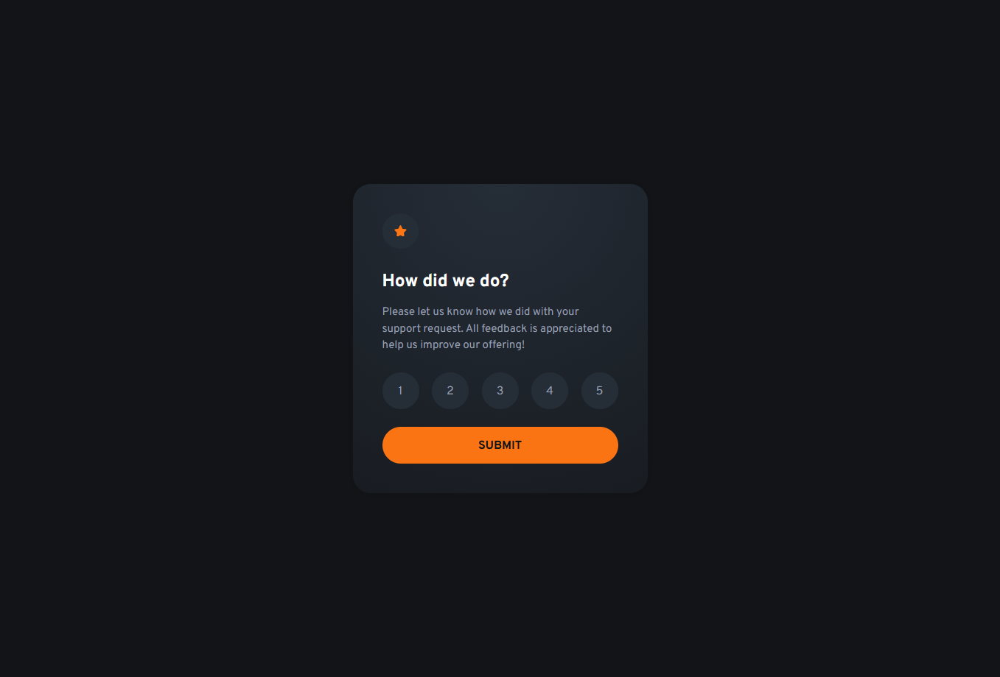
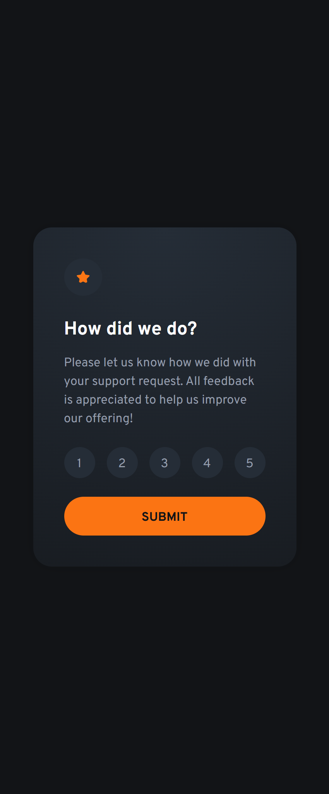

# 🎯 **Interactive Rating Component**  
*A Frontend Mentor Challenge*  

[](https://www.frontendmentor.io/challenges/interactive-rating-component-koxpeBUmI)


**Live Demo:** 🔗 [Vercel](https://interactive-rating-component-muhaideen-nausars-projects.vercel.app/)  
**Challenge Link:** 🔗 [Frontend Mentor Challenge](https://www.frontendmentor.io/challenges/interactive-rating-component-koxpeBUmI)

---

## 🖼️ **Preview**  
| Desktop View | Mobile View |
|--------------|-------------| 
|  |  |

---

## 📌 **About This Project**  
This is my solution to the **Interactive Rating Component** challenge from [Frontend Mentor](https://frontendmentor.io). The goal was to build a responsive, interactive rating interface using **vanilla JavaScript**.  

### 🧠 **What I Learned**  
- **DOM Manipulation**: Dynamically updating the UI based on user input.  
- **Event Handling**: Managing click events for rating selection and submission.  
- **CSS Transitions**: Animations for state changes (e.g., hover effects).  
- **Validation**: Basic validation to ensure a rating is selected.  

---

## 🛠️ **Tech Stack**  
- **Frontend**:  
  
  
    

---

## 🚀 **How to Use**  
Since this is a static frontend challenge:  
1. Clone the repository:  
   ```bash
   git clone https://github.com/muhaideennausar/interactive-rating-component.git
   ```  
2. Open `index.html` in your browser.  


---

## 🌟 **Features**  
- Interactive rating selection with hover states.  
- Thank-you state after submission.  
- Responsive layout using CSS Flexbox/Grid.

---

## 📬 **Connect With Me**  
Let’s talk code or collaborate!  
- **GitHub**: [@muhaideennausar](https://github.com/muhaideennausar)  
- **Frontend Mentor**: [Muhaideen Nausar](https://www.frontendmentor.io/profile/muhaideennausar)  

---

## 📜 **License**  
This challenge is part of a [Frontend Mentor](https://www.frontendmentor.io) challenge. **Code is open-source** (MIT License), but design assets belong to Frontend Mentor.   

---

🙌 **Acknowledgments**  
- [Frontend Mentor](https://www.frontendmentor.io) for the challenge.  
- [MDN Web Docs](https://developer.mozilla.org/) for JS/CSS references.  
